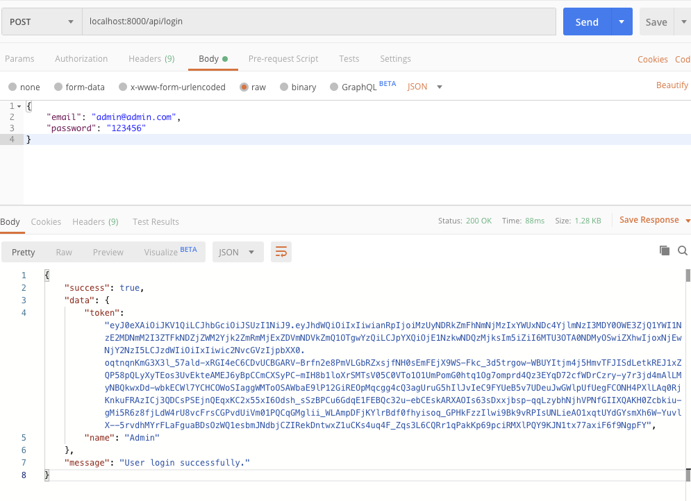

## Auth


### Primeira Configuração

```bash
composer require laravel/passport

php artisan migrate

php artisan passport:install
```


Agora, vamos atualizar nosso modelo de usuário para:

```php
<?php
  
namespace App;
  
use Illuminate\Notifications\Notifiable;
use Illuminate\Contracts\Auth\MustVerifyEmail;
use Laravel\Passport\HasApiTokens;
use Illuminate\Foundation\Auth\User as Authenticatable;
  
class User extends Authenticatable implements MustVerifyEmail
{
    use HasApiTokens, Notifiable;

    /**
     * The attributes that are mass assignable.
     *
     * @var array
     */
    protected $fillable = [
        'name', 'email', 'password',
    ];

    /**
     * The attributes that should be hidden for arrays.
     *
     * @var array
     */
    protected $hidden = [
        'password', 'remember_token',
    ];

    /**
     * The attributes that should be cast to native types.
     *
     * @var array
     */
    protected $casts = [
        'email_verified_at' => 'datetime',
    ];
}

```


Vamos também alterar nosso `app\Providers\AuthServiceProvider.php` adicionando:

```php
use Laravel\Passport\Passport;

```

E também alterar nossas `guards` do arquivo `config/auth.php`

```php

    'guards' => [
        'web' => [
            'driver' => 'session',
            'provider' => 'users',
        ],

        'api' => [
            'driver' => 'passport',
            'provider' => 'users',
        ],
    ],
```


### Adicionando Rotas e Controller de Autenticação

```php
/* No arquivo routes/api.php */

Route::post('login', 'API\LoginController@login');
```

E vamos criar um arquivo chamado `AuthController` na pasta `app\Http\Controllers\API` com o conteúdo:

```php
<?php
   
namespace App\Http\Controllers\API;
   
use Illuminate\Http\Request;
use App\Http\Controllers\API\BaseController as BaseController;
use App\User;
use Illuminate\Support\Facades\Auth;
use Validator;
   
class LoginController extends BaseController
{
    /**
     * Login api
     *
     * @return \Illuminate\Http\Response
     */
    public function login(Request $request)
    {
        if(Auth::attempt(['email' => $request->email, 'password' => $request->password])){ 
            $user = Auth::user(); 
            $success['token'] =  $user->createToken('Laravel')-> accessToken; 
            $success['name'] =  $user->name;
   
            return $this->sendResponse($success, 'User login successfully.');
        } 
        else{ 
            return $this->sendError('Unauthorised.', ['error'=>'Unauthorised']);
        } 
    }
}
```


### Testando:

```json
{
	"email": "admin@admin.com",
	"password": "123456"
}
```

