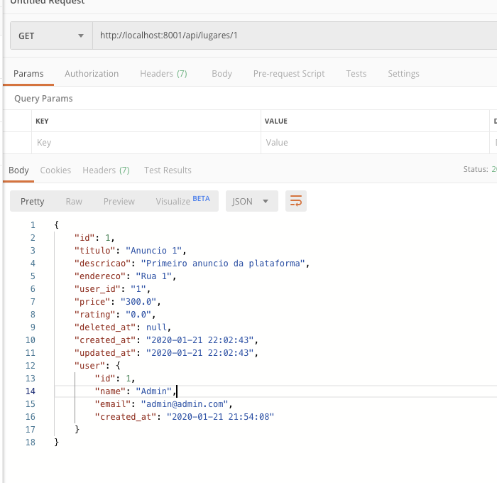

# Criando o Microsserviço de Lugares

Para começar todo o processo, vamos clonar este repositório que já contem todos os projetos criados e configurados para agilizar nosso processo de construção:

```bash
git clone https://github.com/tutagomes/laravel-api-example.git
cd laravel-api-example
```


E então instalamos as dependências:

```bash
cd MicroDia4

cd micro_auth
composer install
php artisan migrate:fresh --seed

cd ..
cd micro_avaliacoes
touch database.sqlite
composer install

cd ..
cd micro_gateway
npm install

cd ..
cd micro_lugares
touch database.sqlite
composer install
```

**OU**

```bash
chmod a+x install_all.sh
./install_all.sh
```


Para começar a criar nosso microsserviço, vamos primeiro definir nosso modelo, as migrações e aplicá-las no banco. O caminho para a DB já está configurado corretamente no nosso `.env`, então não há necessidade de alterações.

### Criando Modelo

> Todos os passos abaixo devem ser executados na pasta `micro_lugares` !

Vamos começar criando um modelo através do comando:

```bash
touch app/Lugar.php
```

E então vamos adicionar o conteúdo abaixo ao arquivo `app/Lugar.php`

```php
<?php

namespace App;
use Log;
use Illuminate\Database\Eloquent\Model;
use Illuminate\Database\Eloquent\SoftDeletes;

class Lugar extends Model
{
    protected $table = 'lugares';
    use SoftDeletes;

    public function user()
    {
        $client = new \GuzzleHttp\Client();
            $response = $client->request('GET', env('USER_API', 'http://localhost:8000/api/users/').$this->user_id);
            if ($response->getStatusCode() == 200) {
                $data = json_decode($response->getBody()->getContents(), true);
                return $data;
            }
            return 'Not Found';
    }
}
```


#### Adicionando ao banco

Vamos então executar um comando para criar a migração na pasta de `micro_lugares`:

```bash
php artisan make:migration create_lugares_table --create=lugares
```

E no nosso arquivo de migrações da pasta `database/migrations/...create_lugares_table.php`:

```php
<?php

use Illuminate\Database\Migrations\Migration;
use Illuminate\Database\Schema\Blueprint;
use Illuminate\Support\Facades\Schema;

class CreateLugaresTable extends Migration
{
    /**
     * Run the migrations.
     *
     * @return void
     */
    public function up()
    {
        Schema::create('lugares', function (Blueprint $table) {
            $table->bigIncrements('id');
            $table->string('titulo');
            $table->string('descricao');
            $table->string('endereco');
            $table->unsignedBigInteger('user_id');
            $table->float('price', 8, 2)->default(0);
            $table->float('rating', 8, 2)->default(0);
            $table->softDeletes();
            $table->timestamps();
        });
    }

    /**
     * Reverse the migrations.
     *
     * @return void
     */
    public function down()
    {
        Schema::dropIfExists('lugares');
    }
}
```

Vamos aproveitar e já adicionar três novos lugares no nosso banco para testes. Vamos então no nosso arquivo `database/seeds/DatabaseSeeder.php`:

```php
<?php

use Illuminate\Database\Seeder;
use App\Lugar;
class DatabaseSeeder extends Seeder
{
    /**
     * Run the database seeds.
     *
     * @return void
     */
    public function run()
    {
        $lugar = Lugar::firstOrNew(['id' => 1]);
        $lugar->fill([
            'titulo' => "Anuncio 1",
            'descricao' => "Primeiro anuncio da plataforma",
            'endereco' => 'Rua 1',
            'user_id' => 1,
            'price' => 300.00
        ])->save();

        $lugar = Lugar::firstOrNew(['id' => 2]);
        $lugar->fill([
            'titulo' => "Anuncio 2",
            'descricao' => "Segundo anuncio da plataforma",
            'endereco' => 'Rua 2',
            'user_id' => 1,
            'price' => 200.00
        ])->save();

        $lugar = Lugar::firstOrNew(['id' => 3]);
        $lugar->fill([
            'titulo' => "Anuncio 3",
            'descricao' => "Terceiro anuncio da plataforma",
            'endereco' => 'Rua 2',
            'user_id' => 2,
            'price' => 500.00
        ])->save();

    }
}
```


E agora sim podemos aplicar as migrações no banco:

```
php artisan migrate --seed
```


#### Criando Rota e Controller

Depois de criar nosso modelo e banco, é necessário criar um Controller e uma rota para que possamos expor os dados através da API REST.

`routes/web.php`

```php
<?php

/*
|--------------------------------------------------------------------------
| Application Routes
|--------------------------------------------------------------------------
|
| Here is where you can register all of the routes for an application.
| It is a breeze. Simply tell Lumen the URIs it should respond to
| and give it the Closure to call when that URI is requested.
|
*/

$router->get('/', function () use ($router) {
    return $router->app->version();
});

$router->group(['prefix' => 'api'], function () use ($router) {
    $router->get('lugares', ['uses' => 'LugaresController@index']);
    $router->get('lugares/{id}', ['uses' => 'LugaresController@show']);
    $router->post('lugares', ['uses' => 'LugaresController@store']);
    $router->put('lugares/{id}', ['uses' => 'LugaresController@update']);
    $router->delete('lugares{id}', ['uses' => 'LugaresController@destroy']);
});
```


E finalmente criar o controller:

```bash
touch app/Http/Controllers/LugaresController.php
```

E adicionar ao arquivo `app/Http/Controllers/LugaresController.php`

```php
<?php

namespace App\Http\Controllers;

use Illuminate\Http\Request;
use App\Lugar;
use Validator;

class LugaresController extends Controller
{
    /**
     * Display a listing of the resource.
     *
     * @return \Illuminate\Http\Response
     */
    public function index()
    {
        //
        $lugares = Lugar::all();
        return response()->json($lugares, 200);
    }
    /**
     * Store a newly created resource in storage.
     *
     * @param  \Illuminate\Http\Request  $request
     * @return \Illuminate\Http\Response
     */
    public function store(Request $request)
    {
        $input = $request->all();

        $validator = Validator::make($input, [
            'titulo' => 'required',
            'descricao' => 'required',
            'endereco' => 'required',
            'user_id' => 'required'
        ]);
   
        if($validator->fails()){
            return $this->sendError('Validation Error.', $validator->errors());       
        }

        $lugar = Lugar::create($input);
        return response()->json($lugar, 201);
    }

    /**
     * Display the specified resource.
     *
     * @param  int  $id
     * @return \Illuminate\Http\Response
     */
    public function show($id)
    {
        //
        $lugar = Lugar::findOrFail($id);
        $lugar->user = $lugar->user();
        return response()->json($lugar, 200);
    }
    /**
     * Update the specified resource in storage.
     *
     * @param  \Illuminate\Http\Request  $request
     * @param  int  $id
     * @return \Illuminate\Http\Response
     */
    public function update(Request $request, $id)
    {
        //
        Lugar::find($id)->update($request->all());
      	$lugar = Lugar::find($id);
        return response()->json($lugar, 200);

    }

    /**
     * Remove the specified resource from storage.
     *
     * @param  int  $id
     * @return \Illuminate\Http\Response
     */
    public function destroy($id)
    {
        //
        $lugar = Lugar::findOrFail($id);
        $lugar->delete();
        return response()->json('{ "success": true, "message": "Lugar successfully deleted!', 200);
    }
}

```


Agora finalmente podemos servir nossa aplicação através do comando:

```bash
php -S 0.0.0.0:8001 -t public
```

