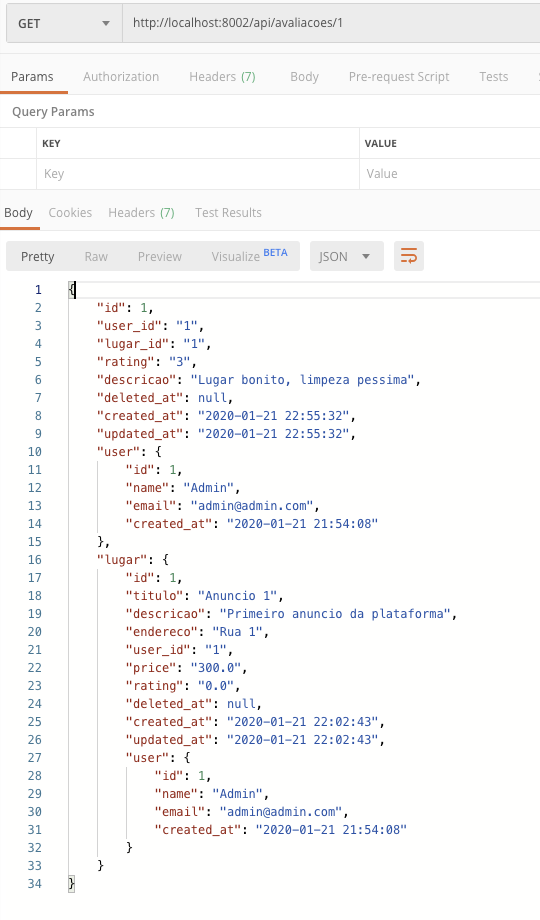

# Criando o Microsserviço de Avaliações

Para começar a criar nosso microsserviço, vamos primeiro definir nosso modelo, as migrações e aplicá-las no banco. O caminho para a DB já está configurado corretamente no nosso `.env`, então não há necessidade de alterações.

### Criando Modelo

> Todos os passos abaixo devem ser executados na pasta `micro_avaliacoes` !

Vamos começar criando um modelo através do comando:

```bash
touch app/Avaliacao.php
```

E então vamos adicionar o conteúdo abaixo ao arquivo `app/Lugar.php`

```php
<?php

namespace App;
use Log;
use Illuminate\Database\Eloquent\Model;
class Avaliacao extends Model
{
    protected $table = 'avaliacoes';
    public function lugar()
    {
        $client = new \GuzzleHttp\Client();
            $response = $client->request('GET', env('LUGAR_API', 'http://localhost:8001').'/api/lugares/'.$this->lugar_id);
            if ($response->getStatusCode() == 200) {
                $data = json_decode($response->getBody()->getContents(), true);
                return $data;
            }
            return 'Not Found';
    }
  public function user()
    {
        $client = new \GuzzleHttp\Client();
            $response = $client->request('GET', env('USER_API', 'http://localhost:8000').'/api/users/'.$this->user_id);
            if ($response->getStatusCode() == 200) {
                $data = json_decode($response->getBody()->getContents(), true);
                return $data;
            }
            return 'Not Found';
    }
}

```


#### Adicionando ao banco

Vamos então executar um comando para criar a migração na pasta de `micro_avaliacoes`:

```bash
php artisan make:migration create_avaliacoes_table --create=avaliacoes
```

E no nosso arquivo de migrações da pasta `database/migrations/...create_avaliacoes_table.php`:

```php
<?php

use Illuminate\Database\Migrations\Migration;
use Illuminate\Database\Schema\Blueprint;
use Illuminate\Support\Facades\Schema;

class CreateAvaliacoesTable extends Migration
{
    /**
     * Run the migrations.
     *
     * @return void
     */
    public function up()
    {
        Schema::create('avaliacoes', function (Blueprint $table) {
            $table->bigIncrements('id');
            $table->unsignedBigInteger('user_id');
            $table->unsignedBigInteger('lugar_id');
            $table->integer('rating')->default(0);
            $table->string('descricao')->default('');
            $table->softDeletes();
            $table->timestamps();
        });
    }

    /**
     * Reverse the migrations.
     *
     * @return void
     */
    public function down()
    {
        Schema::dropIfExists('avaliacoes');
    }
}

```

Vamos aproveitar e já adicionar três novos lugares no nosso banco para testes. Vamos então no nosso arquivo `database/seeds/DatabaseSeeder.php`:

```php
<?php

use Illuminate\Database\Seeder;
use App\Avaliacao;
class DatabaseSeeder extends Seeder
{
    /**
     * Run the database seeds.
     *
     * @return void
     */
    public function run()
    {
        $rating = Avaliacao::firstOrNew(['id' => 1]);
        $rating->fill([
            'user_id' => 1,
            'lugar_id' => 1,
            'rating' => 3,
            'descricao' => 'Lugar bonito, limpeza pessima'
        ])->save();

        $rating = Avaliacao::firstOrNew(['id' => 2]);
        $rating->fill([
            'user_id' => 2,
            'lugar_id' => 1,
            'rating' => 5,
            'descricao' => 'Otimo lugar'
        ])->save();

        $rating = Avaliacao::firstOrNew(['id' => 3]);
        $rating->fill([
            'user_id' => 3,
            'lugar_id' => 2,
            'rating' => 4,
            'descricao' => 'Faltou piscina'
        ])->save();

    }
}
```


E agora sim podemos aplicar as migrações no banco:

```
php artisan migrate --seed
```


#### Criando Rota e Controller

Depois de criar nosso modelo e banco, é necessário criar um Controller e uma rota para que possamos expor os dados através da API REST.

`routes/web.php`

```php
<?php

/*
|--------------------------------------------------------------------------
| Application Routes
|--------------------------------------------------------------------------
|
| Here is where you can register all of the routes for an application.
| It is a breeze. Simply tell Lumen the URIs it should respond to
| and give it the Closure to call when that URI is requested.
|
*/

$router->get('/', function () use ($router) {
    return $router->app->version();
});

$router->group(['prefix' => 'api'], function () use ($router) {
    $router->get('avaliacoes', ['uses' => 'AvaliacoesController@index']);
    $router->get('avaliacoes/{id}', ['uses' => 'AvaliacoesController@show']);
    $router->post('avaliacoes', ['uses' => 'AvaliacoesController@store']);
    $router->put('avaliacoes/{id}', ['uses' => 'AvaliacoesController@update']);
    $router->delete('avaliacoes{id}', ['uses' => 'AvaliacoesController@destroy']);
});
```


E finalmente criar o controller:

```bash
touch app/Http/Controllers/AvaliacoesController.php
```

E adicionar ao arquivo `app/Http/Controllers/AvaliacoesController.php`

```php
<?php

namespace App\Http\Controllers;

use Illuminate\Http\Request;
use App\Avaliacao;
use Validator;

class AvaliacoesController extends Controller
{
    /**
     * Display a listing of the resource.
     *
     * @return \Illuminate\Http\Response
     */
    public function index()
    {
        //
        $rating = Avaliacao::all();
        return response()->json($rating, 200);
    }
    /**
     * Store a newly created resource in storage.
     *
     * @param  \Illuminate\Http\Request  $request
     * @return \Illuminate\Http\Response
     */
    public function store(Request $request)
    {
        $input = $request->all();

        $validator = Validator::make($input, [
            'user_id' => 'required',
            'lugar_id' => 'required',
            'rating' => 'required',
            'descricao' => 'required'
        ]);
   
        if($validator->fails()){
            return $this->sendError('Validation Error.', $validator->errors());       
        }

        $rating = Avaliacao::create($input);
        return response()->json($rating, 201);
    }

    /**
     * Display the specified resource.
     *
     * @param  int  $id
     * @return \Illuminate\Http\Response
     */
    public function show($id)
    {
        //
        $rating = Avaliacao::findOrFail($id);
        $rating->user = $rating->user();
        return response()->json($rating, 200);
    }
    /**
     * Update the specified resource in storage.
     *
     * @param  \Illuminate\Http\Request  $request
     * @param  int  $id
     * @return \Illuminate\Http\Response
     */
    public function update(Request $request, $id)
    {
        //
        Avaliacao::find($id)->update($request->all());
        $rating = Avaliacao::find($id);
        return response()->json($rating, 200);

    }

    /**
     * Remove the specified resource from storage.
     *
     * @param  int  $id
     * @return \Illuminate\Http\Response
     */
    public function destroy($id)
    {
        //
        $rating = Avaliacao::findOrFail($id);
        $rating->delete();
        return response()->json('{ "success": true, "message": "Lugar successfully deleted!', 200);
    }
}
```


Agora finalmente podemos servir nossa aplicação através do comando:

```bash
php -S 0.0.0.0:8002 -t public
```



