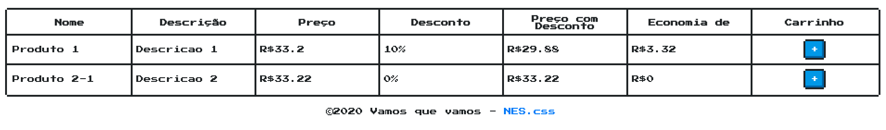

## [Introdução](https://laravel.com/docs/6.x/blade)

> Blade is the simple, yet powerful templating engine provided with Laravel. Unlike other popular PHP templating engines, Blade does not restrict you from using plain PHP code in your views. In fact, all Blade views are compiled into plain PHP code and cached until they are modified, meaning Blade adds essentially zero overhead to your application. Blade view files use the `.blade.php` file extension and are typically stored in the `resources/views` directory.


### Criando um template padrão

Uma das grandes funcionalidades que o Blade oferece é a capacidade de se entender layouts. Para isso, vamos começar criando um cabeçalho e um *footer* para podermos utilizar em todas as nossas páginas.

```bash
mkdir resources/views/common
touch resources/views/common/Header.blade.php
touch resources/views/common/Footer.blade.php
```


No nosso cabeçalho `Header.blade.php`, vamos começar adicionando os arquivos CSS e JS que vamos utilizar para montar o estilo da nossa aplicação.

```php
<html lang="{{ str_replace('_', '-', app()->getLocale()) }}">
    <head>
        <meta charset="utf-8">
        <meta name="viewport" content="width=device-width, initial-scale=1">

        <title>Laravel</title>
        <link href="https://fonts.googleapis.com/css?family=Press+Start+2P" rel="stylesheet">
        <link href="https://unpkg.com/nes.css/css/nes.css" rel="stylesheet" />
        <script src="https://cdn.jsdelivr.net/npm/vue/dist/vue.js"></script>

        <style>
        html, body, pre, code, kbd, samp {
            font-family: 'Press Start 2P', cursive;
        }
        </style>
</head>
```


E no nosso `Footer.blade.php`

```php
<footer style='witdh: 100%; text-align: center'><p><span>©2020</span> Vamos que vamos <span>-</span> <a href="https://nostalgic-css.github.io/NES.css/" target="_blank" rel="noopener">NES.css</a></p></footer>
</html>
```


E vamos agora criar uma nova View já mostrando nossos produtos em um visual mais adequado do que o JSON:

```bash
touch resources/views/produtos.blade.php
```

E o conteúdo:

```php
@include('common/Header')
<main style='width: 100%; text-align: center'>
<div class="nes-table-responsive" style='padding: 20px; width: 100%'>
  <table class="nes-table is-bordered is-centered"style='width: 100%'>
    <thead>
      <tr>
        <th>Nome</th>
        <th>Descrição</th>
        <th>Preço</th>
        <th>Desconto</th>
        <th>Preço com Desconto</th>
        <th>Economia de</th>
        <th>Carrinho</th>
      </tr>
    </thead>
    <tbody>
@foreach ($produtos as $pdt)
      <tr>
        <td>{{$pdt->title}}</td>
        <td>{{$pdt->short_description}}</td>
        <td>R${{$pdt->price}}</td>
        <td>{{$pdt->discount}}%</td>
        <td>R${{$pdt->precoComDesconto()}}</td>
        <td>R${{$pdt->economiaDe()}}</td>
        <td style='text-align: center'><button type="button" class="nes-btn is-primary">+</button></td>
      </tr>    
@endforeach
</tbody>
  </table>
</div>
</main>
@include('common/Footer')
```


E como nós acessamos esses dados? Temos que redirecionar nossos usuários para lá, através das rotas `web.php`:

```php
<?php

/*
|--------------------------------------------------------------------------
| Web Routes
|--------------------------------------------------------------------------
|
| Here is where you can register web routes for your application. These
| routes are loaded by the RouteServiceProvider within a group which
| contains the "web" middleware group. Now create something great!
|
*/

Route::get('/', function () {
    return view('welcome');
});

Route::get('/produtos', function () {
    return view('produtos', ['produtos' => \App\Produto::all()]);
});
```



E agora, vamos criar também uma interface em VueJS criando um arquivo chamado `produtoVue.blade.php` com o conteúdo:

```php
@include('common/Header')
<main style='width: 100%; text-align: center' id="app">
<div class="nes-table-responsive" style='padding: 20px; width: 100%'>
  <table class="nes-table is-bordered is-centered"style='width: 100%'>
    <thead>
      <tr>
        <th>Nome</th>
        <th>Descrição</th>
        <th>Preço</th>
        <th>Desconto</th>
        <th>Preço com Desconto</th>
        <th>Economia de</th>
        <th>Carrinho</th>
      </tr>
    </thead>
    <tbody>
      <tr v-for='pdt in produtos' :key='pdt.id'>
        <td> @{{ pdt.title}}</td>
        <td> @{{ pdt.short_description}}</td>
        <td>R$ @{{ pdt.price}}</td>
        <td> @{{ pdt.discount}}%</td>
        <td>R$ @{{ calculaPrecoComDescontoProduto(pdt)}}</td>
        <td>R$ @{{ calculaEconomia(pdt)}}</td>
        <td style='text-align: center'><button type="button" class="nes-btn is-primary">+</button></td>
      </tr>    
</tbody>
  </table>
</div>
</main>
<script>
const app = new Vue({
        el: '#app',
        data: {
         produtos: @json($produtos)
       },
       methods: {
         calculaPrecoComDescontoProduto (pdt) {
           let preco = parseFloat(pdt.price)
           let desconto = parseFloat(pdt.discount)
           return (preco - preco*(desconto/100)).toFixed(2)
         },
         calculaEconomia (pdt) {
           let preco = parseFloat(pdt.price)
           let desconto = parseFloat(pdt.discount)
           return (preco*(desconto/100)).toFixed(2)
         }
       }
     });
</script>
@include('common/Footer')

```


E assim, podemos inclusive adicionar mais funcionalidades, como:

```php
@include('common/Header')
<main style='width: 100%; text-align: center' id="app">
<div class="nes-table-responsive" style='padding: 20px; width: 100%'>
  <table class="nes-table is-bordered is-centered"style='width: 100%'>
    <thead>
      <tr>
        <th>Nome</th>
        <th>Descrição</th>
        <th>Preço</th>
        <th>Desconto</th>
        <th>Preço com Desconto</th>
        <th>Economia de</th>
        <th>Carrinho</th>
      </tr>
    </thead>
    <tbody>
      <tr v-for='pdt in produtos' :key='pdt.id'>
        <td> @{{ pdt.title}}</td>
        <td> @{{ pdt.short_description}}</td>
        <td>R$ @{{ pdt.price}}</td>
        <td> @{{ pdt.discount}}%</td>
        <td>R$ @{{ calculaPrecoComDescontoProduto(pdt)}}</td>
        <td>R$ @{{ calculaEconomia(pdt)}}</td>
        <td style='text-align: center'><button type="button" @click='addToCarrinho(pdt)' class="nes-btn is-primary">+</button></td>
      </tr>    
</tbody>
  </table>
</div>
<div  v-if='carrinho.length > 0'>
<h3>Carrinho</h3>
<div class="nes-table-responsive" style='padding: 20px; width: 100%'>
  <table class="nes-table is-bordered is-centered"style='width: 100%'>
    <thead>
      <tr>
        <th>Nome</th>
        <th>Preço</th>
        <th>Quantidade</th>
        <th>Remover</th>
      </tr>
    </thead>
    <tbody>
      <tr v-for='produto in carrinho' :key='produto ? produto.pdt.id : 0'>
        <td v-if='produto'> @{{ produto.pdt.title}}</td>
        <td v-if='produto'>R$ @{{ calculaPrecoComDescontoProduto(produto.pdt)}}</td>
        <td v-if='produto'> @{{ produto.qnt}}</td>
        <td style='text-align: center' v-if='produto'><button type="button" @click='removeCarrinho(produto)' class="nes-btn is-danger">x</button></td>
      </tr>    
</tbody>
  </table>
  Total do pedido: R$@{{totalPedido}}
</div>
</div>
</main>
<script>
const app = new Vue({
        el: '#app',
        data: {
         produtos: @json($produtos),
         carrinho: [],
         totalPedido: 0
       },
       methods: {
         calculaPrecoComDescontoProduto (pdt) {
           let preco = parseFloat(pdt.price)
           let desconto = parseFloat(pdt.discount)
           return (preco - preco*(desconto/100)).toFixed(2)
         },
         calculaEconomia (pdt) {
           let preco = parseFloat(pdt.price)
           let desconto = parseFloat(pdt.discount)
           return (preco*(desconto/100)).toFixed(2)
         },
         addToCarrinho(pdt) {
           let pedido = {}
           pedido.pdt = pdt
           if (!(pdt.id in this.carrinho)) {
             pedido.qnt = 1
             this.carrinho[pdt.id] = pedido
           } else {
             this.carrinho[pdt.id].qnt ++
           }
           this.$forceUpdate();
           this.calculaTotalPedido()
         },
         removeCarrinho(produto) {
           this.carrinho.splice(produto.pdt.id, 1)
         },
         calculaTotalPedido() {
          let total = 0
          for(let pdt of this.carrinho) {
            if (pdt) {
              total += pdt.pdt.price * pdt.qnt
            }
          }
          this.totalPedido = total.toFixed(2)
         }
       }
     });
</script>
@include('common/Footer')
```

