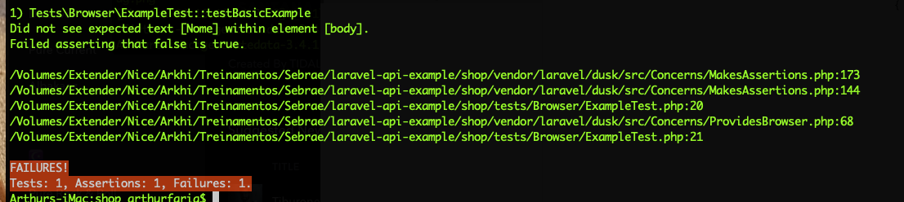

## [Dusk](https://laravel.com/docs/6.x/dusk)

```bash
composer require --dev laravel/dusk
php artisan dusk:install
php artisan dusk
php artisan dusk:fail

# caso necessite
sudo apt-get install chromium-browser
php artisan serve --host=0.0.0.0:8000 &
```

E vamos alterar nosso `tests/DuskTestCase.php`

```php
<?php

namespace Tests;

use Facebook\WebDriver\Chrome\ChromeOptions;
use Facebook\WebDriver\Remote\DesiredCapabilities;
use Facebook\WebDriver\Remote\RemoteWebDriver;
use Laravel\Dusk\TestCase as BaseTestCase;

abstract class DuskTestCase extends BaseTestCase
{
    use CreatesApplication;

    /**
     * Prepare for Dusk test execution.
     *
     * @beforeClass
     * @return void
     */
    public static function prepare()
    {
        static::startChromeDriver();
    }

    /**
     * Create the RemoteWebDriver instance.
     *
     * @return \Facebook\WebDriver\Remote\RemoteWebDriver
     */
    protected function driver()
    {
        $options = (new ChromeOptions)->addArguments([
            '--disable-gpu',
            '--headless',
            '--window-size=1920,1080',
            '--no-sandbox',
        ]);

        return RemoteWebDriver::create(
            'http://localhost:9515', DesiredCapabilities::chrome()->setCapability(
                ChromeOptions::CAPABILITY, $options
            )
        );
    }
}

```

E nosso `Browser/ExampleTests.php`

```php
<?php

namespace Tests\Browser;

use Illuminate\Foundation\Testing\DatabaseMigrations;
use Laravel\Dusk\Browser;
use Tests\DuskTestCase;

class ExampleTest extends DuskTestCase
{
    /**
     * A basic browser test example.
     *
     * @return void
     */
    public function testBasicExample()
    {
        $this->browse(function (Browser $browser) {
            $browser->visit('/produtos')
                    ->assertSee('Nome');
        });
    }
}

```



E claro que não irá executar, já que nosso APP_URL no arquivo `.env` não nos direciona para a porta correta.

```.env
APP_URL=http://localhost:8000
```

