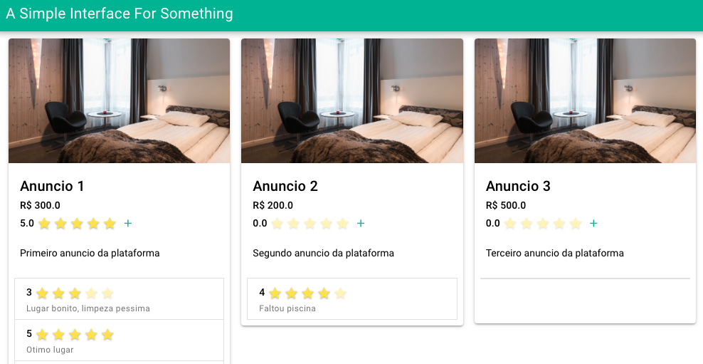

### Gateway


E claro, nosso arquivo de Gateway, que já está configurado na pasta `MicroDia4/micro_gateway`:

```js
var http = require('http');
const express = require('express')
const httpProxy = require('express-http-proxy')
const app = express()
var cookieParser = require('cookie-parser');
var logger = require('morgan');
const helmet = require('helmet');
const cors = require("cors");

const userServiceProxy = httpProxy(process.env.USER_API ? process.env.USER_API : 'http://localhost:8000');
const placesServiceProxy = httpProxy(process.env.LUGAR_API ? process.env.LUGAR_API : 'http://localhost:8001');
const ratingServiceProxy = httpProxy(process.env.AVALIACAO_API ? process.env.AVALIACAO_API : 'http://localhost:8002');

const port = 9000;
app.use(cors());

// Proxy request
app.all('/api/users', (req, res, next) => {
  userServiceProxy(req, res, next);
})
app.all('/api/users/*', (req, res, next) => {
  userServiceProxy(req, res, next);
})
 
app.all('/api/lugares', (req, res, next) => {
  placesServiceProxy(req, res, next);
})
app.all('/api/lugares/*', (req, res, next) => {
  placesServiceProxy(req, res, next);
})

app.all('/api/avaliacoes', (req, res, next) => {
  ratingServiceProxy(req, res, next);
})
app.all('/api/avaliacoes/*', (req, res, next) => {
  ratingServiceProxy(req, res, next);
})


app.use(logger('dev'));
app.use(helmet());
app.use(express.json());
app.use(express.urlencoded({ extended: false }));
app.use(cookieParser());

var server = http.createServer(app);
server.listen(port);
console.log('Escutando na porta: ' + port);
```

Agora podemos também executar o Gateway e a interface para os serviços:

Na pasta `micro_gateway`

```bash
npm start
```

Na pasta `interface`

```bash
quasar dev
```

